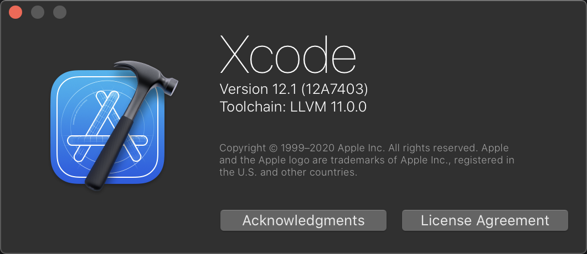

## LLVM Toolchain Maker



```bash
sh llvm_toolchain_maker.sh
```

If everything is ok, It will make a bundle named `LLVM_11.0.0.xctoolchain`

`11.0.0` is version defined in script and you can modify it for a newer version on [llvm.org](http://releases.llvm.org/download.html)

## Install to Xcode

```
cd /Applications/Xcode.app/Contents/Developer/Toolchains
ln -s /Path/to/your/LLVM_11.0.0.xctoolchain LLVM_11.0.0.xctoolchain
```

Menu `Xcode` -> `Toolchains`, switch to `LLVM 11.0.0`

more about toolchain you can learn from [here](https://lvvme.com/posts/2018/12/20_xcode_toolchain/)
